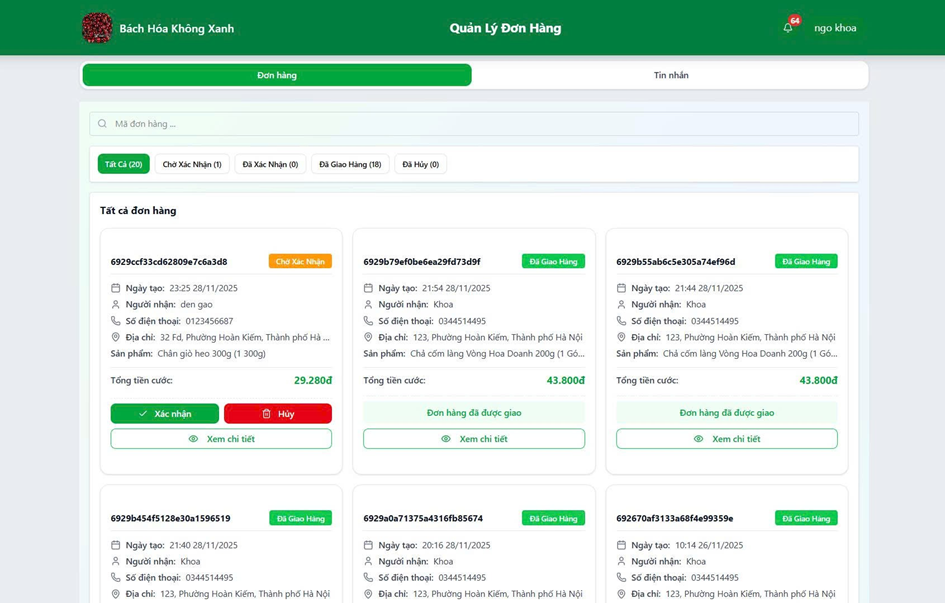
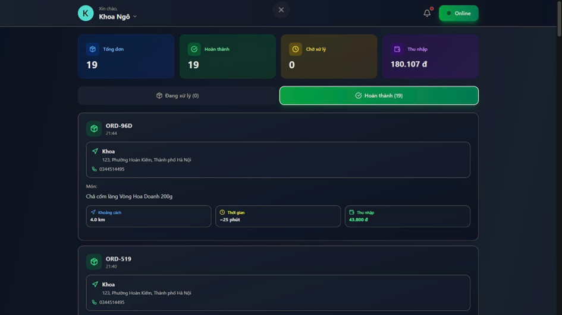
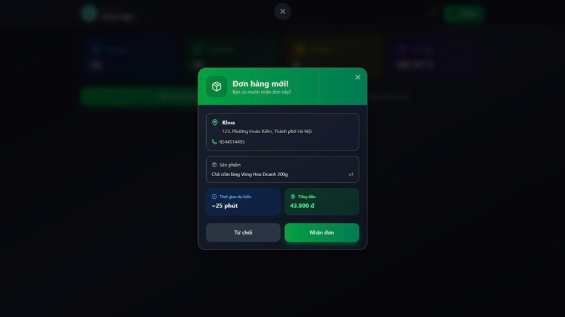
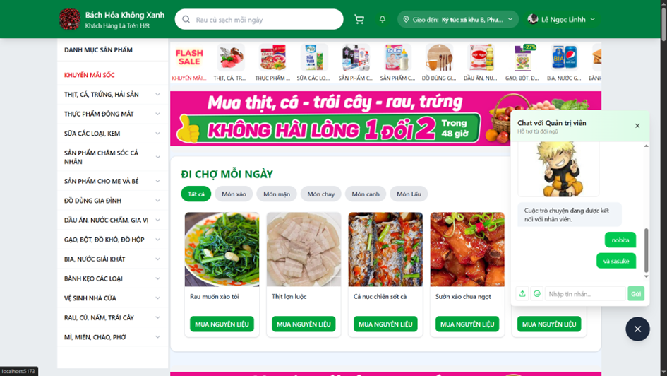
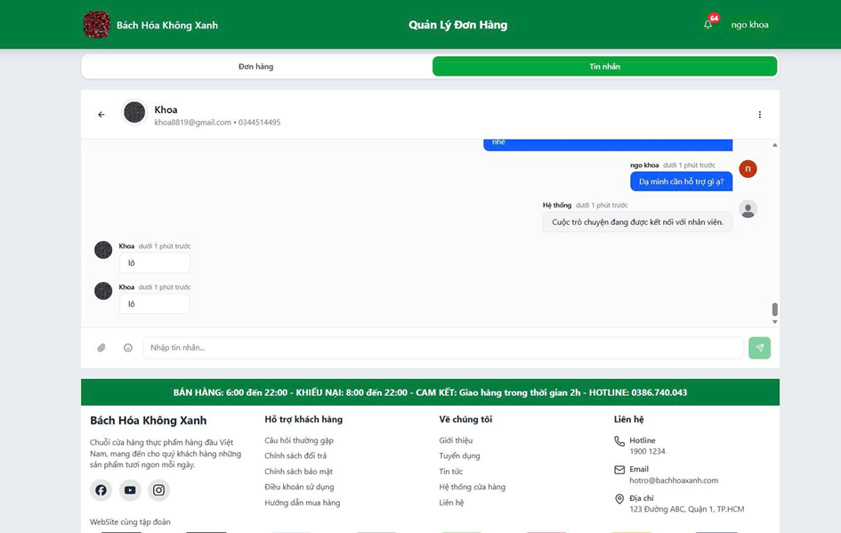

# Web Siêu Thị Server (NestJS Backend)

## 📝 Giới thiệu

Đây là phần Backend (máy chủ) cho hệ thống **Web Siêu Thị**, cung cấp hệ thống API mạnh mẽ và bảo mật để phục vụ trải nghiệm mua sắm của khách hàng, bảng điều khiển quản trị cho cửa hàng và ứng dụng theo dõi cho nhân viên giao hàng (shipper).

## 🚀 Công nghệ sử dụng

- **Framework:** NestJS
- **Database:** MongoDB (sử dụng Mongoose)
- **Caching & Message Queue:** Redis & BullMQ
- **Real-time:** Socket.io (Thông báo & Chat trực tuyến)
- **Authentication:** JWT, Passport, Google OAuth 2.0
- **Khác:** VNPay (Cổng thanh toán), Cloudinary (Lưu trữ ảnh), Nodemailer & Twilio (Email/SMS), Google GenAI.

## 🏗️ Kiến trúc

Dự án được xây dựng dựa trên kiến trúc **Module của NestJS**, áp dụng Dependency Injection để tách biệt Controller và Service, giúp code dễ dàng mở rộng và bảo trì. Các tác vụ nặng được đẩy vào Background Job Queue thông qua BullMQ.

## 🏗️ Cấu trúc dự án

Dưới đây là sơ đồ tổ chức thư mục mã nguồn chính (`src/`) của dự án:

```text
src/
├── common/             # Decorators, Guards, Interceptors dùng chung
├── config/             # Cấu hình hệ thống (Database, Redis, v.v.)
├── modules/            # Các module nghiệp vụ chính (Auth, Catalog, Order, v.v.)
│   ├── auth/           # Xác thực & Phân quyền
│   ├── catalog/        # Danh mục & Sản phẩm
│   ├── order/          # Quản lý Đặt hàng
│   ├── shipper/        # Nghiệp vụ Giao hàng
│   └── ...             # Các module khác
├── shared/             # Các dịch vụ dùng chung (Cloudinary, Mailer, v.v.)
├── types/              # Định nghĩa các Interface và Type
└── main.ts             # Điểm khởi đầu của ứng dụng
```

## 🌟 Các tính năng chính (chèn ảnh)

### 🔐 Xác thực & Phân quyền

- Đăng ký, Đăng nhập, và Xác thực qua OTP Email.
- Đăng nhập nhanh bằng tài khoản Google.
- Phân quyền người dùng chi tiết (Admin, Customer, Staff, Shipper).

### 🛍️ Quản lý danh mục & Tìm kiếm sản phẩm

- Thêm, sửa, xoá sản phẩm và danh mục hàng hóa.

### 🛒 Xử lý giỏ hàng & Đặt hàng

- Quản lý giỏ hàng, áp dụng các mã giảm giá.
- Tích hợp tính toán khoảng cách tự động để tính phí giao hàng.
- Thanh toán trực tuyến an toàn thông qua cổng **VNPay**.

### 🚚 Quản lý đơn hàng & Giao hàng (Shipper)

- Quản lý vòng đời đơn hàng: Chờ xác nhận -> Đang xử lý -> Đang giao dịch -> Đã giao.
- Phân bổ đơn hàng cho Shipper, tính toán thời gian, quãng đường và chi phí giao hàng.

<div align="center">
  
  <p><i>Giao diện quản lý đơn hàng của nhân viên</i></p>
  <br/>
  
  <p><i>Giao diện quản lý đơn của shipper</i></p>
  <br/>
  
  <p><i>Giao diện nhận đơn của shipper</i></p>
</div>

### 💬 Tương tác theo thời gian thực (Real-time)

- Chat trực tuyến giữa khách hàng và nhân viên hỗ trợ thông qua **Socket.io**.
- Thông báo đẩy (push notifications) khi trạng thái đơn hàng thay đổi.

<div align="center">
  
  <p><i>Giao diện chat trực tuyến</i></p>
  <br/>
  
  <p><i>Giao diện hội thoại với khách hàng của staff</i></p>
</div>

### ⭐ Đánh giá & Bình luận

- Hỗ trợ khách hàng đánh giá và bình luận sản phẩm sau khi mua.

## 🛠️ Cài đặt

1. Clone dự án: `git clone https://github.com/KhoaDang113/web-sieu-thi-server-nestjs.git`
2. Cài đặt dependency: `npm install`
3. Cài đặt biến môi trường: Tạo file `.env` dựa trên `.env.example`.
4. Khởi chạy các dịch vụ database với Docker: `docker-compose up -d` (Mở file `docker-compose.yaml` để lấy Redis, Elasticsearch...).
5. Chạy dự án ở chế độ dev: `npm run dev`

## 💡 Bài học kinh nghiệm

- Cách xử lý đồng bộ dữ liệu giữa MongoDB primer và Elasticsearch để tìm kiếm luôn chính xác.
- Áp dụng Message Queue (BullMQ) để xử lý gửi Email/OTP hoặc tạo hoá đơn không làm nghẽn luồng xử lý chính.
- Cách thiết kế Real-time Socket.io cho kiến trúc nhiều người dùng truy cập đồng thời.
